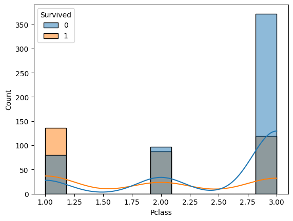

# EXNO-6-DS-DATA VISUALIZATION USING SEABORN LIBRARY

# Aim:
  To Perform Data Visualization using seaborn python library for the given datas.

# EXPLANATION:
Data visualization is the graphical representation of information and data. By using visual elements like charts, graphs, and maps, data visualization tools provide an accessible way to see and understand trends, outliers, and patterns in data.

# Algorithm:
STEP 1:Include the necessary Library.

STEP 2:Read the given Data.

STEP 3:Apply data visualization techniques to identify the patterns of the data.

STEP 4:Apply the various data visualization tools wherever necessary.

STEP 5:Include Necessary parameters in each functions.

# Coding and Output:
 ```
import pandas as pd
import seaborn as sns
import matplotlib.pyplot as plt
df=pd.read_csv("titanic_dataset.csv")
df.head()
 ```
 
 ```
x=[1,2,3,4,5]
y=[3,6,2,7,1]
sns.lineplot(x=x,y=y)
plt.title('Line Plot')
```

```
x=[1,2,3,4,5]
y1=[3,5,2,6,1]
y2=[1,6,4,3,8]
y3=[5,2,7,1,4]
sns.lineplot(x=x,y=y1)
sns.lineplot(x=x,y=y2)
sns.lineplot(x=x,y=y3)
plt.title('Multi Line Plot')
```

```
plt.figure(figsize=(8,5))
sns.barplot(x='Embarked',y='Fare',data=df,palette='rainbow')
plt.title("Fare Of Passenger By Embarked Town")
```

```
sns.scatterplot(x="Age", y="Fare", data=df)
plt.title('Scatterplot of Age vs Fare')
plt.show()
```

```
sns.scatterplot(x="Age", y="Fare", size="Pclass", data=df, sizes=(30, 200))
plt.title('Bubble Chart of Age vs Fare, Size by Passenger Class')
plt.show()
```

```
sns.histplot(data=df,x="Pclass",hue="Survived",kde=True)
```

```
sns.boxplot(x='Pclass',y='Age',data=df,palette='rainbow')
plt.title("Age By Passenger Class")
```

```
sns.violinplot(x="Pclass", y="Fare", data=df)
plt.title('Violin Plot of Fare by Passenger Class')
plt.show()
```

```
sns.kdeplot(data=df['Age'], shade=True)
plt.title('Density Plot of Passenger Ages')
plt.show()
```

```
numeric_df = df.select_dtypes(include=['float64', 'int64'])
corr_matrix = numeric_df.corr()
sns.heatmap(corr_matrix, annot=True, cmap='coolwarm')
plt.title('Heatmap of Titanic Dataset')
plt.show()
```

# Result:
 Thus, the Data Visualization using seaborn python library for the given data is implemented successfully
